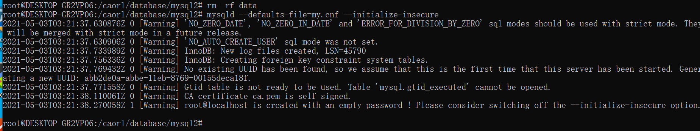
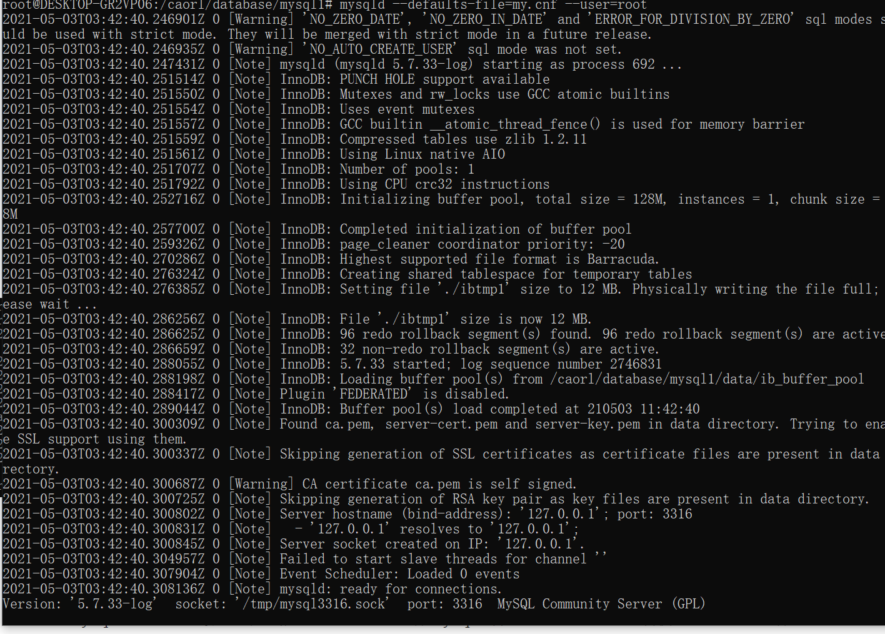
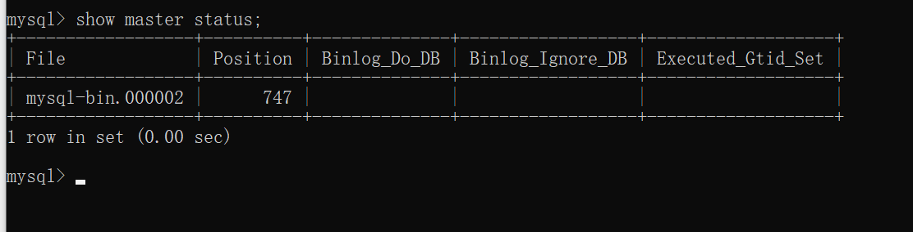
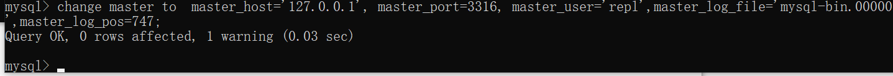
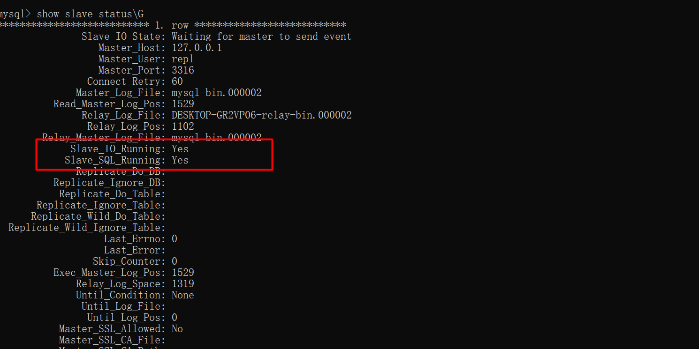

#### MySQL主从复制配置
1. 官网下载MySQL5.7的linux安装包

2. 安装MySQL

3. 配置my.cnf(linux)

   ```
   # 这里要填0.0.0.0，如果填127.0.0.1外部可能会访问不到
   bind-address = 0.0.0.0
   port = 3326
   server-id = 2
   datadir = /caorl/database/mysql2/data
   socket = /tmp/mysql3326.sock
   
   sql_mode=NO_ENGINE_SUBSTITUTION,STRICT_TRANS_TABLES
   log_bin=mysql-bin
   binlog-format=Mixed
   
   # 显示指定默认值为timestamp类型的字段(MySQL5.7)
   explicit_defaults_for_timestamp=true
   ```


4. 初始化数据库（默认无密码）

   ```
   mysqld --defaults-file=my.cnf --initialize-insecure
   ```




4. 启动数据库

   ```
   mysqld --defaults-file=my.cnf --user=root
   ```

   此处 mysql是出于安全考虑，默认拒绝用root账号启动mysql服务。--user=root强制使用root账号启动

   

5. 在主节点创建用户

   ```
   create user 'repl2'@'%' identified by '123456';
   ```

   ```
   grant replication slave on *.* to 'repl'@'%';
   ```

   ```
   flush privileges;
   ```

   ```
   show master status;
   ```

   show mater status,查看偏移量position，用于配置同步节点

   

6. 配置从节点（默认是异步复制）

   从节点需要重复上面的初始化与安装过程（不包括创建master用户）

   ```
   change master to  master_host='127.0.0.1', master_port=3316, master_user='repl',master_password='123456',master_log_file='mysql-bin.000007',master_log_pos=747;
   ```

   ```
   start slave;
   ```

   

7. 从库查看从节点状态

   \G换行显示，更形象一定

   ```
   show slave status\G
   ```

   

8. 开启半同步复制

   参考文章：[主从复制](https://www.cnblogs.com/gered/p/11239898.html)
   1)修改配置文件主库与从库的my.cnf

```
   plugin_dir=/usr/lib/mysql/plugin/
   plugin_load=rpl_semi_sync_master=semisync_master.so;rpl_semi_sync_slave=semisync_slave.so
   
   #如果是5.7，参数前面加上loose_，如下列，如果是5.6 则直接使用 rpl_semi_sync_master_enabled=1 之类的就好了。
   #我这里是5.7就直接做增强半同步了（loseless Semisynchronous ）
   loose_rpl_semi_sync_master_enabled=1 #MySQL开启主的半同步复制（rpl_semi_sync_master_enabled）
   loose_rpl_semi_sync_slave_enabled=1 #MySQL5.6开启从的半同步复制
   loose_rpl_semi_sync_master_timeout=5000 #超时5秒，切回异步
   rpl_semi_sync_master_wait_for_slave_count=1 #至少收到1个slave发会的ack
   rpl_semi_sync_master_wait_point=AFTER_SYNC #MySQL 5.7的方法，AFTER_SYNC（default，增强半同步） & AFTER_COMMIT（传统半同步）
```

2)重启主库，重启从库slave

3)主库查看半同步配置状态

```
   show status like '%rpl_semi%';
```

9. 开启组复制

   [MySQL 5.7 基于组复制](https://www.cnblogs.com/kevingrace/p/10260685.html)

10. 在主库创建应用程序的连接用户，并授权（主库添加后权限也会同步到从库）

    应该赋予主库用户读写权限，从库读权限（此处偷懒没有设置多个用户）

```
create user 'slave'@'%' identified by '123456';
```

```
grant all on *.* to slave@'%' identified by '123456';
```

```
flush privileges;
```


#### 读写分离理解

1. 分别配置主从的SpringBean，利用@ConfigurationProperties注解注入配置文件的所有主从数据源，然后配置集成数据源Map的主从配置AbstractRoutingDataSource(Spring提供的路由数据源)的实现类
2. AbstractRoutingDataSource数据源的主要实现方法determineCurrentLookupKey()，从ThreadLocal中读取当前使用的数据源
3. Spring配置MyBatis的SqlSessionFactory，设置数据源为配置的AbstractRoutingDataSource，并配置PlatformTransactionManager为AbstractRoutingDataSource
4. 在操作数据库前先设置当前AbstractRoutingDataSource数据源的key值(可使用AOP对Service或Mapper进行切面)，然后真正调用数据源的时候就会根据Key值去取最终的执行数据源

