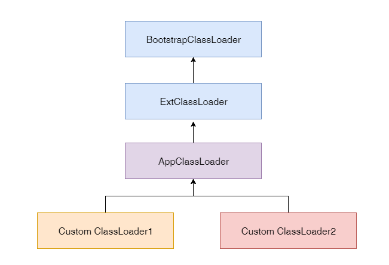
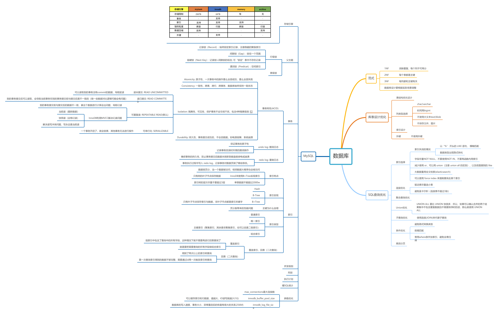

### 一、JVM

#### 一段代码执行过程

当前线程创建自己的线程栈，调用一个对象的方法时，会先加载类（已经加载直接返回），然后实例化对象在堆中。使用单例模式（比如SpringBean）则能省去加载类和初始化对象的过程。每调用一个对象的方法就会在线程栈上创建栈帧（方法的操作数栈，局部变量数组，运行时常量池），方法执行完之后就出栈，方法里还有调用其他方法则会再压栈。如果是个递归方法，没有设置好结束条件，就会一直压栈到超出栈深度(Xss)，出现StackOverFlow

#### SpringBean不会被回收

一个spring bean默认初始化为单例对象，长期会被spring容器保持，容器寄存在servlet的成员变量的servetcontext中，即应用服务器不关闭，引用将一直存在。如开始的成员变量，注入的对象，内存空间一直被引用着，jvm不会回收它们的空间

#### 静态变量回收

静态变量相当于是类的变量，类是也是对象，静态变量会一直被引用，只要类加载没有被回收，类就会一直存在，静态变量也会一直存在

#### 类加载器回收？

1. 字节码

   字节码主要是了解基本操作指令、执行原理与应用场景：AOP、Lombok、动态修改class(热部署)

2. 类加载器

   类加载需要简单了解生命周期，熟悉双亲委派机制、自定义类加载器，使用场景：字节码加密、中间件依赖加载、热部署

   

   

3. JVM内存模型（重要）

   熟悉JVM内存模型与模型设计原理，比如分代假设的好处

   

   

4. JMM内存模型

   熟悉线程通信模型、指令重排、内存屏障

5. GC（重要）

   熟悉基本的GC算法、GC回收器、GC触发的时机、对象不可用的判断

   

   

### 二、NIO

IO就是存储内容的输入输出，所有的程序都可以理解为输入、计算、输出；

#### IO分类

##### BIO

传统IO流就是阻塞的，应用程序访问系统内核(recvfrom)，数据准备好之前应用程序要一直等待

##### NIO

1. NIO的三大核心（应用层面）：buffer,channel,selector。selector绑定多个channel，访问内核是否有数据，有数据的话就用channel从buffer中取数据，拷贝数据用的是堆外直接内存，实现零拷贝
2. NIO的selector实现原理：系统内核的select,poll,epoll。select与poll差不多，select有1024的fd文件描述符上限，poll是链表。epoll是使用回调机制，不需要轮询
3. IO多路复用（IO Multiplexing) 是这么一种机制：程序注册一组socket文件描述符给操作系统，表示“我要监视这些fd是否有IO事件发生，有了就告诉程序处理”。
4. IO多路复用是要和NIO一起使用的。尽管在操作系统级别，NIO和IO多路复用是两个相对独立的事情

##### AIO

AIO需要操作系统支持，少用

#### IO模型

##### 阻塞IO

##### 非阻塞IO

##### IO复用

##### 信号驱动（UDP）

##### 异步IO

### 三、并发编程

1. Java并发编程有一个固定的线程模型(JMM)，定义了线程之间变量如何访问。

2. 并发编程需要熟悉线程的生命周期，Java一切皆对象，线程的生命周期，其实也是对象的生命周期的一部分，只是线程的生命周期有自己的特点。

3. Java开发线程是无时无刻都存在，启动一个main方法，会有一个主线程，所有的调度都在线程上，创建自己的线程栈，每调用一个方法就入栈一个栈帧。SpringMVC会每个请求创建一个线程（线程池维护）

   

### 四、Spring和ORM

Spring是一个强大的基础框架，大部分主流的系统都是基于Spring去开发的，IoC和DI为程序员省了很多代码量。ORM框架封装了良好的数据库操作，通过对象操作数据库，减少简单代码的开发量。

### 五、MySQL

SQL是标准化的通用数据库查询语言，MySQL是其中最常用、开源的一种实现。MySQL需要熟悉基本的使用语法、存储引擎、索引实现原理与优化、事务特性与事务隔离级别、慢SQL调优、性能参数优化，单机对的数据存储、IO交互有限，且无法控制高可用。

### 六、分库分表

分库分表能够解决单机数据库存储上限、IO访问上限，具体设计需要根据场景分析。如果只是单表数据过大，磁盘IO压力小的话可以只是分表；如果磁盘IO已经达到瓶颈则必须进行分库处理，将压力分担到其他机器上，有应用程序或者中间件进行路由。一般分库分表都是会做主从备份与读写分离，提高度读写性能与实现高可用。

### 七、RPC和微服务

传统的单体应用无法支撑高并发场景与团队协作，需要利用RPC、微服务对服务进行拆分，并且做到服务分区、高可用、负载均衡。高并发场景下，前端请求会先经过DNS负载均衡，根据ip访问对应的流量网关(Nginx,Kong)，因为流量网关可以承载大量并发。流量网关基本上市透传请求到业务网关，业务网关会在路由到具体的微服务。微服务将应用拆分多个小模块，可以分给不同的团队维护，部署上可以作用分区容错、高可用、高并发，但是会令整体架构比较复杂。

### 八、分布式缓存

在实际使用场景中，用户查询数据的量远远大于操作数据，而磁盘IO的效率相对较低，使用内存作为缓存能够大大增加数据（读多写少）查询的效率。而在分布式应用中，应用分布在不同的机子上，所以需要将缓存单独作为中间件为所有的应用做统一的数据缓存，当然，缓存本身也需要做到读写分离、数据分区、高可用，才能够满足海量数据查询。

### 九、分布式消息队列

消息队列主要作用就是削峰、解耦、异步，最主要的是作为一个消息中间件，在不同的系统之间传递消息，并且中间件本身是与本台、语言无关。在分布式系统中，中间件自然要做到分区、高可用、异地容灾。

